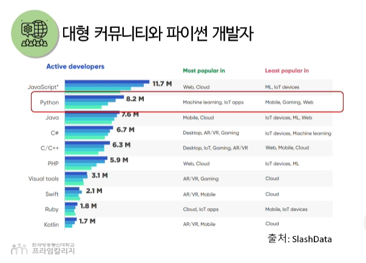
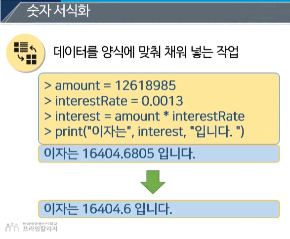
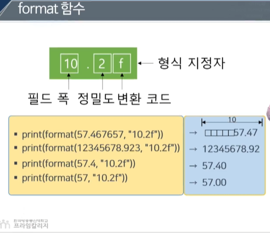
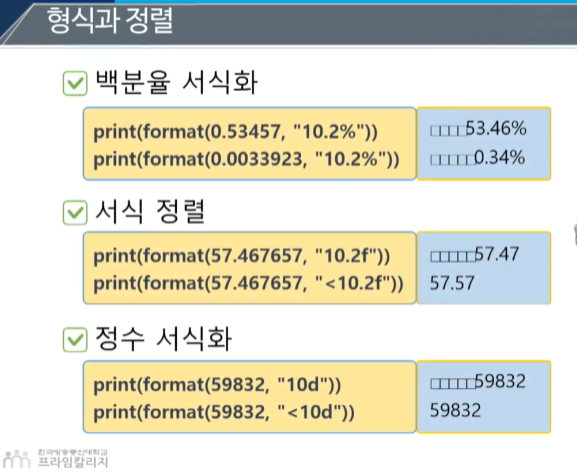

# 파이썬 1장

1장
하드웨어 소프트웨어, 기본적인 간단한 것들 2진법 배우는중...

하드웨어

1비트

1바이트 = 8비트

기억장치

RAM,

무작위 순서로 빠른 접근 가능

전원 차단 시 저장 정보 소실 (휘발성)

저장장치

HDD(누가써요즘 ...)

ODD ...(?)

USB ... (OK)

입력장치

키보드

마우스

출력장치

모니터

프린터 ..

스피커

메인보드

각 컴퓨터 부품을 하나로 연결해주는 회롤를 갖춘 장치
bus 통로를 이용해서 데이터 전달, 일단 ram 으로 간다

소프트웨어
컴퓨터는 자의적으로 데이터 처리하여 정보를 생산하는 것이 불가능 (AI ?)
주어진 문제를 풀기 위해 단계별 정차를 명시한 지시서가 필요
프로그램, 응용 프로그램, 애플리케이션으로도 불림

카드 정렬의 문제

1. 가장 작은 카드 찾기
2. 가장 앞에 있는 카드와 바꾼다
3. 카드가 정렬된었는지 확인하고 아니면 다시 과정을 반복한다
4. 정렬 될때까지
   for문

알고리즘
주어진 문제를 풀기 위한 단계별 정차를 순서적으로 기술한 것

프로그래밍 언어
지시서를 만드는 과정
1세대 (기계어)
2세대
3세대 (파이썬)
4세대
컴파일러 또는 인터프리터를 사용하여 고급언어를 기계어로 변경

실습으로 이동 파이썬다운로드, 파이참 쓰자 .. 실습으로 !!

# 2장

# chapeter.01

귀돈 반 로섬 이 개발
네덜란드 태생, 암스테르담 대학에서 우학과 컴퓨터 전공
ABC 언어의 후속작, 좋아하는 코미디 'Monty Python's Flying Circus'를 따라 명명

파이썬은 개발 목적

사용성, 오픈소스, 인간적, 신속성, 직관적

```
if 4 in [1,2,3,4]: print("4가 있습니다")
```

사람의 언어와 유사

```
c언어

int i;
int sum = 0
for (i=0, ; i<11; i++){
sum +=i;
}
print("합은 %d", sum);
```

```
파이썬

sum = 0
for i in range(1,11)
sum += i
print("합은" + sum)
```



- 풍부한 자원 , 다양한 라이브러리와 프레임워크
- 신속성과 간결성

주피터 노트북

- 프로그램 코드를 브라우저에서 실행해주는 대화식 환경
- 탐색적 데이터 분석에 적합

주피터 랩

- 주티퍼 노트북보다 한층 강화된 기능 제공
- 탐색기, 화면분할, 여러 확장자 지원

# chapeter.02

함수

f(x) 특정 작업을 수행하는 코드의 집합으로 함수의 이름만으로 싱행할 수 있는단위

print 함수 : 화면에 데이터 출력

.png)

소드코드 =

- 명령어 저장
- 파일로 만들어 놓은 것

인코딩 문제

- #-*- coding:utf-8 -*-
- 전세계 모든 언어를 처리 가능한 코딩

들여쓰기

- 프로그램이 같은 그룹인지 다른 그룹인지 판단
- 불필요한 들여쓰기에 주의 해야 한다

프로그래밍 스타일과 문서화

- 적절한 공백 삽입
- 3+4+5 -> 3 + 4 + 5
- 주석 사용
- #(한칸뛰우기)성적계산

## 실습진행

# 3강

## 변수와 연산자

1. 데이터 저장, 변수
2. 숫자 연산자
3. 숫자의 서식화

변수

- 값을 할당
- radius = 20
- 컴퓨터 메모리에 저장된 값을 참조하는 이름
- 특정 메모리 공간에 이름을 할당 하고 사용

식별자

- 프로그램 내부에 있는 항목(변수, 함수, 클래등)의 이름
- 문자, 숫자, 밑줄로 구성
- 문자 또는 밑줄로만 시작가능
- 키워드(if,for 등)와 동일할 수 없음
- 길이 제한이 없음

변수의 사용

- a = 2
- b = 3
- print(a * b)

할당문과 표현식

- 할당문: 변수에 어떠한 값을 할당하는 명령문
- variable = expression
- 표현식: 값, 변수, 연산자를 포함한 계산식
- 1
- 1.0
- 5 * ( 3 / 2 ) + 3 * 2

동시 할당문
- 복수개의 변수에 값을 동시에 할당
- var1,var2...var10 = exp1,exp2...exp10
- x,y = 10, width + hight
```
temp = var1
var1 = var2
var2 = temp
```

## 숫자 연산자

연산자
- 피연산자에 실행해야 하는 행동 또는 동작을 지시하는 연산 또는 부호


- 정수 나눗셈 (//)
- 지수승 (**)


- 모듈로 연산자 (%)
- 나눗셈의 나머지를 계산하는 수학적 연산

확장 항당 연산자
- 연산자 (+, /, %, **등)와 =을 조합하고 연산 후 변수 자신에게 재할당
```
count = 5
count += 1
print(count)

동일
 
count = 5
count = count + 1
print(count)

=6
```

파이썬 내장 함수
- 파이썬 인터프리터에서 기본적으로 지원하는 함수
- max(2, 3, 4)
- min
- round
- abc
- pow
- 등

수학 함수
- 모듈에서 사용
- facs(x)
- ceil(x)
- floor(x)
- exp(x)
- 등


# chapter.03

## 숫자 서식화

- 데이터를 양식에 맞춰 채워 넣는 작업



- format 함수



## 행식과 정렬

- 백분율 서식화



## 실습진행


